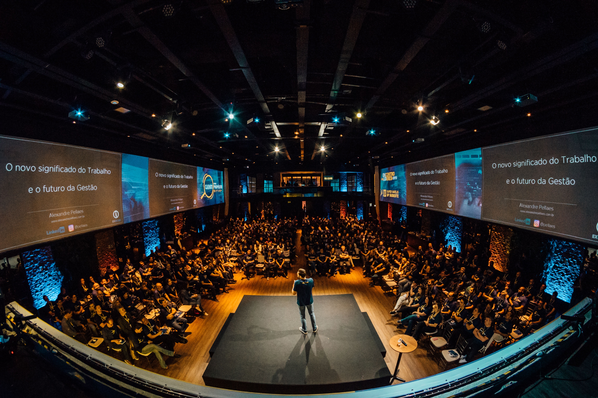
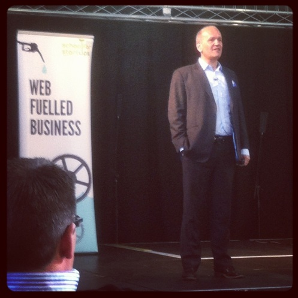

Yesterday I attended the Web Fuelled Business event at Castle Gate, Newcastle upon Tyne. This event was organised by the School for Startups. The speakers were Doug Richard and James Dening (click here for information on the speakers). In my opinion the event was very well organised and I did take away quite a bit from the sessions. The Castle Gate venue was a wonderful venue and the venue staffs were excellent. 

<!--more-->

The entire event was held in the Turbine Hall. I got to the venue quite early so I did get to sit up front and got some pictures of Doug and James during their sessions. I enjoyed all the session and can’t really pick out a particular session that I really liked best.

One of the things James discussed in his session on market places was scaling your business using Amazon’s delivery system. This was something that was totally new to me. James explained that Amazon will store and ship your products that have been sold through their Marketplace. He also discussed how he uses the Amazon delivery service for products bought from his Amazon Marketplace. I couldn’t believe what an amazing service Amazon provides for its sellers.



There were certain things that were said that really caught my attention, they were
1. An entrepreneur has to stop being an inventor and move to put things around that idea to build a business – As a software developer I can really relate to this. I often find myself excited about the technology or architecture of a system and forget about the selling of that product or service.
2. Low prices and large selection are essential for e-commerce websites.
3. Sacrifice short term profits for long term customer retention. – I guess ‘The Customer is still King’
4. Being on Page 2 of a Google search result is like being in Internet Siberia – This really brings home the point how much search engines impact our browsing of the internet.
5. The war of the click is greater than the war of price. – Reduce the barriers to your site. Too many clicks are just too much effort.
6. Video testimonials on your website have a great impact on your customer’s selection process and are anxiety reducers. Your landing page should have anxiety reducers for your site visitors to help increase their trust in your site.
7. Social media is the Amplification of word of mouth.
8. Don’t create obstacles to outcomes. – This really hit home for me and I started to think about how I have created obstacles in other areas to prevent successful outcomes.
Overall it was an excellent event and I would definitely recommend it to anyone else. Also I would definitely attend the next Web Fuelled event in Newcastle.