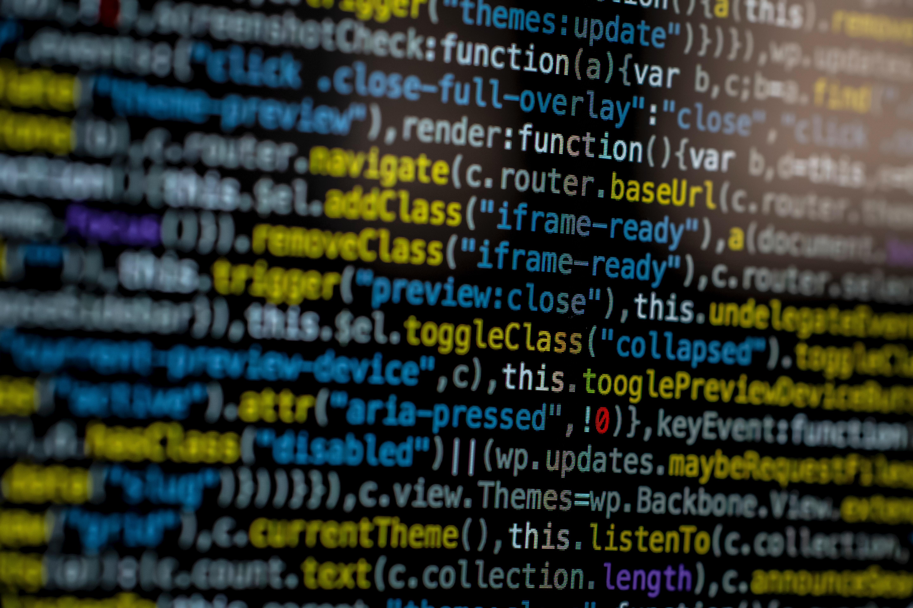

‘Handled Unhandled Exception’ sounds like an oxy-moron, but let me explain what I mean.
I’m sure most developers have seen the code below at some point in their careers.
<!--more-->

```

try
{
//code that does something
}
catch(Exception exc)
{}

```

If you think the catch section is missing some code your absolutely correct. Unfortunately I have seen this type of code quite a few times. This type of error handling is what I like to call a handled unhandled exception, the major problem here is that any unhandled exception is caught but nothing is ever done with it. It’s a nightmare to debug this kind of code because you never know whether the code returns no results or there was an exception thrown. In a real world application this code would be called by other functions which might also have the same style of exceptional handling and this turns out to be extremely difficult to debug.

To be honest I would prefer that the developer wouldn’t wrap the code with a try and catch or atleast re-throw the exception.
In my opinion if you are going to handle an exception, handle them properly don’t just pseudo handle them.
