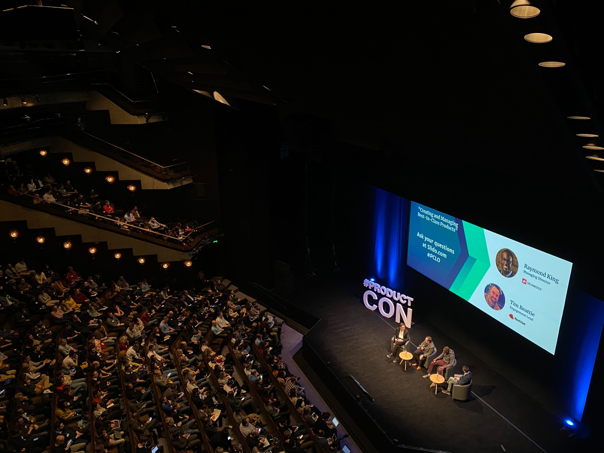
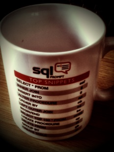

Last Saturday I attended the Red Gate ‘SQL in the City’ event in London. It was one of the best free event that I have been to. The event was very well organised and had a great line up of sessions. There were three tracks of sessions DBA, Red Gate and Developer and I would have liked to attend all of them, but had to choose the ones I really wanted to attend. 

<!--more-->
Fortunately for me the great folks at Red Gate recorded all the sessions and announced that they would be made available for all the attendees.

The day started off with a cup of coffee in one of the best mugs ever!!! It was a mug with the top SQL Prompt snippets and I have to admit I didn’t know some of them. I am happy to report that those snippets are now being used extensively :).

The event was kicked off by the welcome session from Simon Galbraith (Joint CEO of Red Gate). He discussed past Red Gate products and how getting customer feedback early in the development process had a significant impact on the commercial success of the products. I guess you could sum what he said to ‘Release soon, Release Often’ equals greater chance for commercial success.

I stared off with ‘Top Tips for Writing Better – T-SQL stored procedures’. This session was run by Grant Fritchey (ScaryDBA.com). I was quite surprised at how making a few changes to your query could improve it’s performance. It was a really good session for anyone who writes a bit of T-SQL, especially if you are writing queries against a legacy database that wasn’t designed well :(.

I then attended the ‘Prepare for When disaster Strikes’, which was run by Steve Jones, Editor in Chief at SQLServerCentral.com. The session was targeted at DBAs, but as a developer the main thing I got was the importance of increasing your alert time since this gives you more time to react to a problem. I do see the benefit of this since I use Elmah in my web applications and getting a heads up before a user calls me has been extremely useful.

After lunch I attended ‘Deployment Horrors and How to avoid them’ by Dave Ballantyne and followed that with ‘Case Study – How we learned to stop worrying and love Continuous Integration’ by Dave Green and Annette Allen from First Databank. For the final session I thought I would try a wild card session and went to the ‘SQL Azure from Plan, to Backup, to Cloud – Red Gate Cloud-Ready Services’. This session was run by Tobiasz Koprowski and Richard Mitchell. I was really surprised how much I liked the session. It was well presented and Tobiasz and Richard did a really great job. I had the misconception of thinking that Azure was SQL server in the cloud, unfortunately there are limitation to having SQL server in the cloud and these limitation aren’t only technical and can be geographic laws. Using Azure depends on the type of application your building and the data you will be storing, some applications are better suited for Azure than others.

Overall it was a great event and I really enjoyed it and will definitely be looking out for the next ‘SQL in the City’ event.

